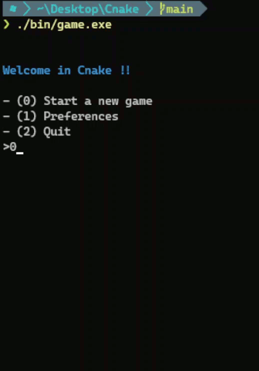

# Cnake
Cnake is a simple Snake game made in C. It will work in Linux and Windows, maybe MacOS. I'll do it on my free time.

### Installation

Clone repo:
```shell
git clone https://github.com/lemoustachu/Cnake.git
```

Change directory:
```shell
cd Cnake
```

and then:
```bash
make clean
make
```

### Gameplay

 

### Roadmap

- [x] menu
- [x] choice of difficulty
- [x] fix to big when starting and score > height
- [ ] fix able to go on top border
- [ ] create more general functions in menu.c
- [ ] get level input and output on numworks calculator
- [ ] add linux support
- [ ] log system
- [ ] maybe network games (multiplayer)
